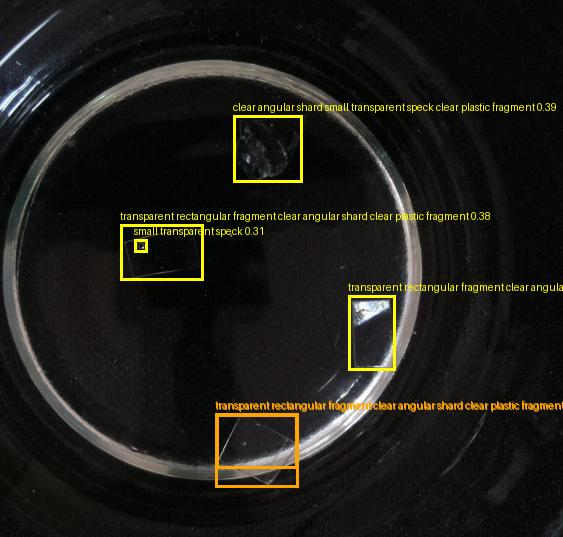

# Experiments for Detecting Microplastic
Using Gemini API + DINO Model

Approach 1:
Gemini as the detector and DINO as the validator of the microplastic

Approach 2:
Gemini describe the picture then the DINO model tries to detect microplastic based on the description

**The best result is Approach 2.**

